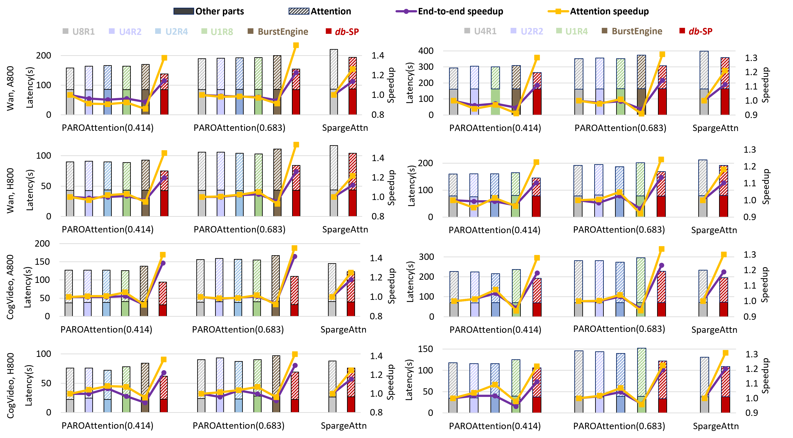

# _db_-SP: Dual-Balanced Sequence Parallelism for Sparse Attention in Visual Generative Models

<!-- [](https://anonymous.4open.science/r/Dual-balance-3ECE)  
[](https://anonymous.4open.science/r/Dual-balance-3ECE) -->

This repository contains the official implementation of **_db_-SP**, a sparsity-aware sequence parallelism strategy designed to accelerate sparse attention in visual generative models (e.g., Diffusion Transformers).  
By addressing workload imbalance at both the **head level** and **block level**, _db_-SP achieves significant speedups in both attention computation and end-to-end inference latency.

## 🚀 Overview

Visual generative models like Diffusion Transformers (DiTs) rely heavily on self-attention, which becomes a bottleneck due to its quadratic complexity. While block-wise sparse attention reduces computation, existing sequence parallelism methods (e.g., Ulysses, Ring Attention) suffer from severe workload imbalance when applied to sparse masks.

**_db_-SP** introduces:
- A **dual-balanced partitioning** method that balances workload across GPUs at both head and block levels
- A **sparsity-aware strategy selection** mechanism that dynamically chooses the optimal parallel strategy per layer
- Minimal overhead through **partitioning reuse** and **biased greedy algorithms**

### Key Results
- **1.25×** end-to-end speedup  
- **1.40×** attention speedup  
- Near-perfect workload balance with **<5% overhead**


## 🧩 Method Highlights

### Imbalance sparse ratio
- Define a sparse imbalance ratio \( $ρ_s$ \) to quantify the workload imbalance

### Dual-Balanced Partitioning
- **Head-Level**: Greedy assignment of attention heads to GPUs based on dense block counts
- **Block-Level**: Biased greedy partitioning of Q/K/V chunks with reward factor \( $R_b$ \) to minimize inter-GPU communication
<!-- 并列显示两张示意图：每列占一半宽度，使用 figure + figcaption 添加注释 -->
<table>
	<tr>
		<td align="center" width="50%">
			<figure>
				
				<figcaption><strong>head-level partitioning</strong></figcaption>
			</figure>
		</td>
		<td align="center" width="50%">
			<figure>
				
				<figcaption><strong>block-level partitioning</strong></figcaption>
			</figure>
		</td>
	</tr>
</table>

### Sparsity-Aware Strategy Selection
- Dynamically predicts the optimal parallel strategy (Ulysses, Ring Attention, or hybrid) per layer using a formula
- Pre-builds communication groups to eliminate runtime overhead

### Overhead Mitigation
- Reuses partitioning plans across denoising steps via similarity threshold \( $P_s$ \)
- Overlaps communication with computation to hide latency

## 📦 Installation
### Dependencies
- Python 3.8
- PyTorch 2.5.1
- CUDA 12.1
- NCCL 2.21.5

### Repo dependencies (3rdparty)
- PAROAttention
- SpargeAttn


### Install from Source
```bash
cd Dual-balance
conda env create -f environment.yml
```

## ⚙️ Usage
### Genearte partitioning plans
```py
sparse, head_perm_idx, new_row_perm_idx, new_col_perm_idx, transpose_matrix_q, transpose_matrix_k, head_deperm_idx, new_row_deperm_idx, new_col_deperm_idx = hybrid_permute_v4(sparse,sp_ulysses_degree,sp_ring_degree,2)
```
### Inference with dp-SP
```py
usp_attn = LongContextAttention(
	ring_impl_type="basic",
	attn_type="paro",
	attn_processor=attn_processor,
)
local_out = usp_attn(
	local_q,
	local_k,
	local_v,
	dropout_p=dropout_p,
	causal=causal,
	window_size=window_size,
	softcap=0.0,
	alibi_slopes=alibi_slopes,
	deterministic=deterministic,
	return_attn_probs=True,
	sparse=local_sparse,
	head_perm_idx=head_perm_idx,
	head_deperm_idx=head_deperm_idx,
	new_row_perm_idx = new_row_perm_idx[rank%sp_ring_degree],
	new_col_perm_idx = new_col_perm_idx[rank%sp_ring_degree],
	new_row_deperm_idx = new_row_deperm_idx[rank%sp_ring_degree],
	transpose_matrix_q = transpose_matrix_q[rank%sp_ring_degree],
	transpose_matrix_q_T = transpose_matrix_q.T[rank%sp_ring_degree],
	transpose_matrix_k = transpose_matrix_k[rank%sp_ring_degree],
	transpose_matrix_k_T = transpose_matrix_k.T[rank%sp_ring_degree],
	transpose_matrix_o = transpose_matrix_q.T[rank%sp_ring_degree],
	transpose_matrix_o_T = transpose_matrix_q[rank%sp_ring_degree],
)
```

### Attention test
```bash
torchrun --nproc_per_node=8 ./test/test_hybrid_attn.py --sp_ulysses_degree 8 --ring_impl_type "basic" --attn_impl "paro"
```
### End-to-end test (xDiT)
- Customize different models to support extra input and output parameters. 
- Change class xFuserLongContextAttention into LongContextAttention	and input the parameters.

### End-to-end test (para)
- Customize a new AttnProcessor2_0  to  replace the original one.
- Customize transformer blocks and pipeline to support extra input and output parameters.
- Change the original transformer blocks
	```py
	with UnifiedAttnMode(mesh):
		hidden_states = self.call_transformer_blocks(
			hidden_states, encoder_hidden_states, timestep_proj, rotary_emb
		)
	```
	into new one and input the parameters.